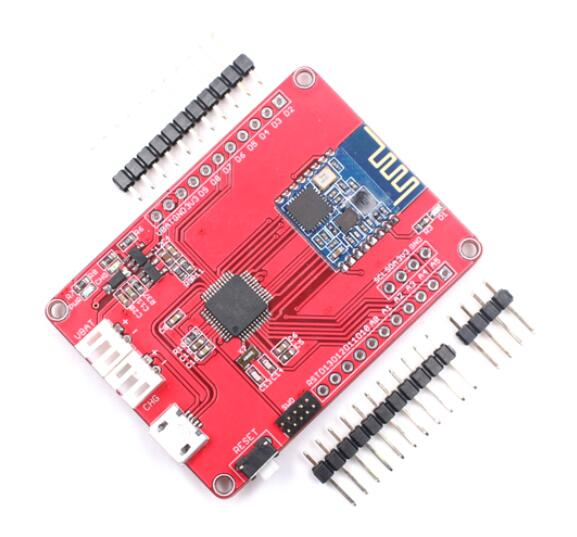
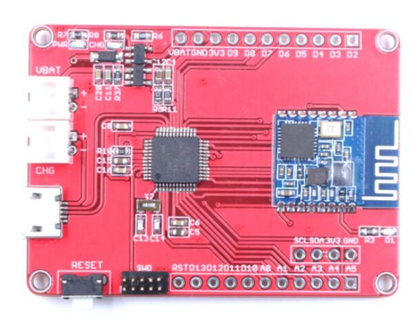
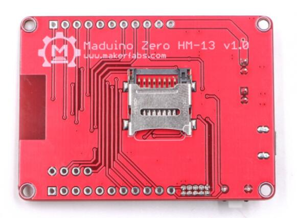

# Maduino Zero Bluetooth 4.0 HM-13


```c++
/*
Version:		V1.0
Author:			Vincent
Create Date:	2021/5/8
Note:
	
*/
```





[toc]

# Makerfabs

[Makerfabs home page](https://www.makerfabs.com/)

[Makerfabs Wiki](https://makerfabs.com/wiki/index.php?title=Main_Page)

# Maduino Zero Bluetooth 4.0 HM-13


## Intruduce

Product Link ：[Maduino Zero Bluetooth 4.0 HM-13](https://www.makerfabs.com/maduino-zero-bluetooth-4.0-hm-13.html) 

Wiki Link :  [Maduino Zero Bluetooth 4.0 HM-13](https://www.makerfabs.com/wiki/index.php?title=Maduino_Zero_Bluetooth_4.0_HM-13) 

Maduino Zero HM-13 is an IoT (Internet of things) Solution based on the 32-bit Atmel's SAMD21 MCU and Bluetooth module HM-13. It integrated a micro Controller ATSAMD21G18, BLE module HM-13. The Maduino Zero HM-13 based on the Arduino, users can program it with Arduino IDE, which is very easy especially suit for the none-programmers. There are also guide for users to learn how to create the first IoT project with this board, with which the starters can learn the hardware and programming skill quickly. With this board, you will easy to add text, SMS, and data to your project. It is good for your smart home project or M2M and so on.


## Feature

- BAT Input Voltage: 3.4-4.2V
- ATSAMD21G18, 32-Bit ARM Cortex M0+
- Integrated Power Control System
- Support AT Command
- BLE and SPP Bluetooth Profile Support
- Support USB Power Charge
- Support Micro SD Card
- Interface: I2C/SPI/UART/18*GPIO*
- *Arduino Compatible*
- *Working Temperature: -40 – 85℃*
- *Size: 40mm*55mm

### Front:



### Back:



## Compiler Options
**If you have any questions，such as how to install the development board, how to download the code, how to install the library. Please refer to :[Makerfabs_FAQ](https://github.com/Makerfabs/Makerfabs_FAQ)**

- Select "Arduino Zero(Native USB port)"